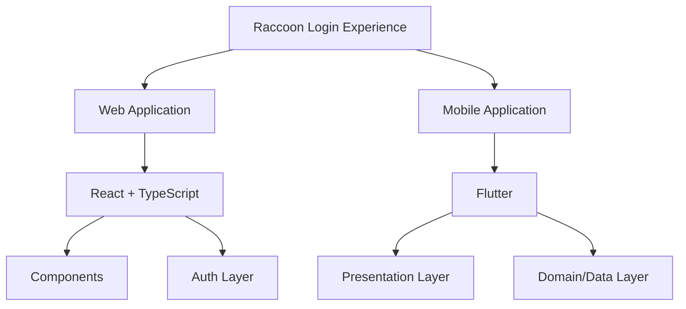

# Raccoon Login Experience


A cross-platform interactive login experience built with **React + TypeScript** and **Flutter**.

This project explores how a simple authentication screen can become a memorable user experience through micro-interactions, animations, and a reactive mascot.

The goal is to provide a reusable, developer-friendly implementation of an engaging login flow.

---

## ✨ Features

- 🦝 Interactive raccoon mascot
- 👀 Context-aware eye movement
- 🐾 Password protection reactions
- 🚪 Animated login entry experience
- ✅ Success and failure authentication states
- 🔐 Password validation flow
- 📱 Cross-platform implementation
  - Web
  - Mobile

---

## 🏗️ Architecture

The project contains two independent implementations sharing the same visual concept.



<details>
<summary>Project Structure</summary>

```
raccoon-login-experience/

├── web/
│   ├── React application
│   ├── Interactive UI components
│   └── Authentication flow

├── mobile/
│   ├── Flutter application
│   ├── Clean feature structure
│   └── Authentication flow

└── shared-assets/
    └── Shared raccoon assets
```

</details>

---

## 🛠️ Tech Stack

### Web


- React
- TypeScript
- Vite
- CSS Modules

### Mobile


- Flutter
- Dart
- Feature-based architecture

---

## 🚀 Getting Started

## Web

```bash
cd web

npm install

npm run dev
```

---

## Mobile

```bash
cd mobile

flutter pub get

flutter run
```

---

## 📂 Development Notes

The project is designed to be easily extended:

- Replace the mock authentication layer with a real backend
- Add custom authentication providers
- Reuse the mascot interaction system in other products
- Extend animations and states

---

## 🔮 Future Improvements

- Real authentication integration
- More mascot interaction states
- Additional themes
- Production-ready authentication services

---

## 📄 License

This project is licensed under the MIT License.

You are free to use, modify, and distribute this project while keeping the original license notice.

---

## 👤 Author

**Parsa Shafizade**

GitHub: [@parsashafizade](https://github.com/parsashafizade)
