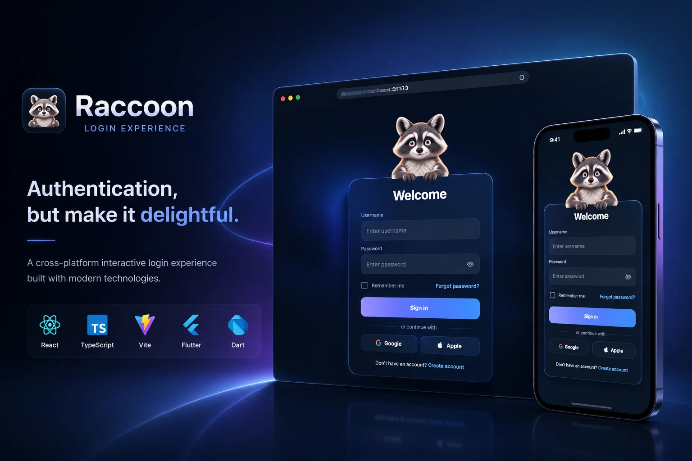
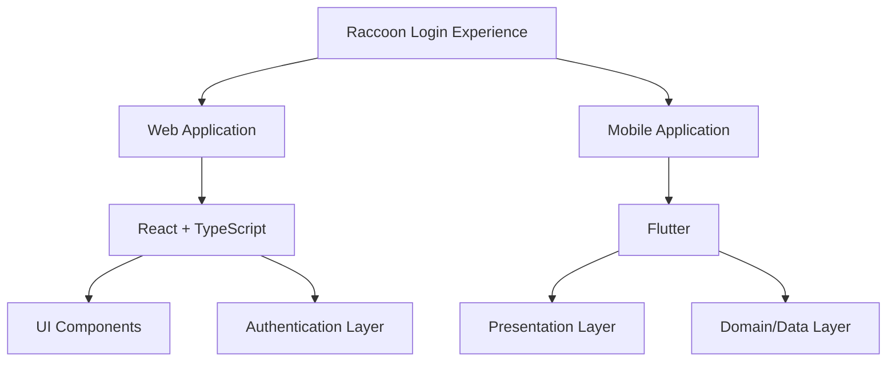
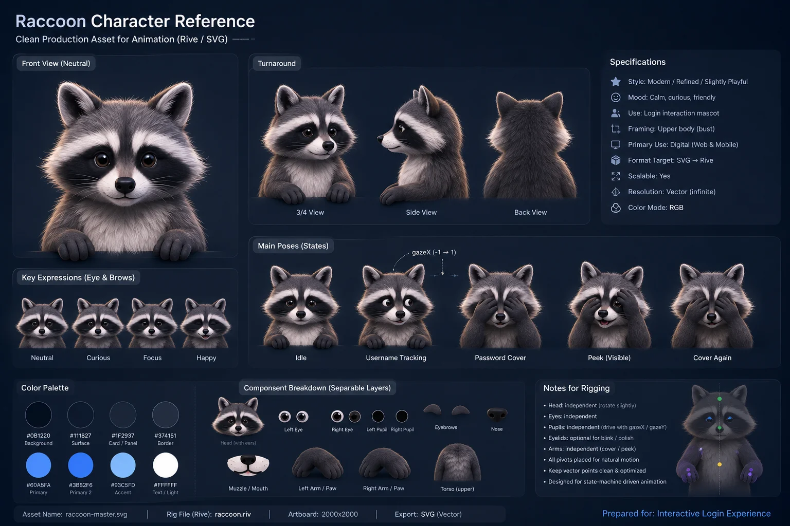

# Raccoon Login Experience

### Interactive Cross-Platform Login Experience

A modern authentication experience built with **React + TypeScript** and **Flutter**.

This project demonstrates how a traditional login screen can become a more engaging product experience through micro-interactions, animations, and a reactive mascot.

Designed as a reusable developer-friendly implementation for modern applications.

<br>

<div align="center">



<br><br>


<br><br>


</div>

---

## ◈ Architecture

The project contains two independent implementations sharing the same product concept.



<br>

<div align="center">



</div>

---

## ◇ Tech Stack

### Web

- React
- TypeScript
- Vite
- CSS Modules

### Mobile

- Flutter
- Dart
- Feature-based architecture

---

## ▷ Getting Started

### Web

```bash
cd web

npm install

npm run dev
```

---

### Mobile

```bash
cd mobile

flutter pub get

flutter run
```

---

## ✦ Future Improvements

- Real authentication backend integration
- Additional mascot interaction states
- More themes and customization options
- Production-ready authentication services

---

## ⌘ License

This project is licensed under the MIT License.

You are free to use, modify, and distribute this project while keeping the original license notice.

---

## ◎ Author

**Parsa Shafizade**

GitHub: https://github.com/parsashafizade
